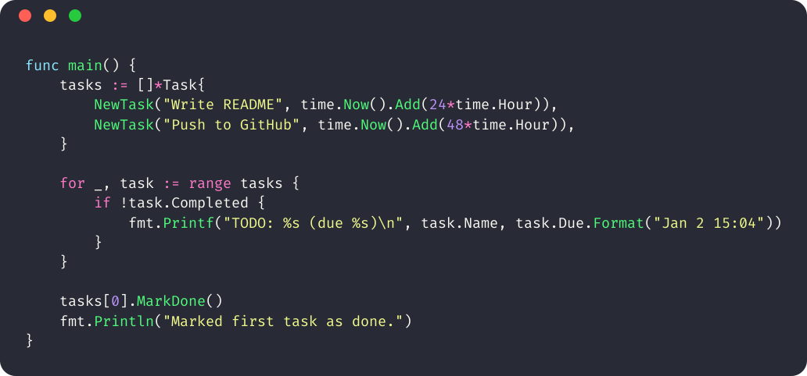

# codeshot

**A CLI tool to turn your code into beautiful, shareable images—right from the command line.**  
Perfect for docs, tweets, slides, bug reports, and more.

<p align="center">

</p>

> [!NOTE]
> Try codeshot with nvim! [codeshot.nvim](https://github.com/flothjl/codeshot.nvim)

---

## ✨ Features

- **Syntax highlighting** for 100+ languages (Chroma-powered)
- **Customizable themes** (Dracula, Gruvbox, OneDark, and more)
- **Modern fonts** (bundled FiraCode or any TTF)
- **Gorgeous output:** rounded corners, shadow, macOS-style bar, true color
- **Easy clipboard copy** (if supported)
- **Direct integration** with editors and scripts (supports piping, files, or raw text)
- **Lightning fast**—written in Go

---

## 🚀 Quick Start

### 1. Install

> Requires Go 1.21+ (for `go install` method).  
> _Prebuilt binaries coming soon!_

```sh
go install github.com/flothjl/codeshot@latest
```

Make sure `$GOBIN` (usually `~/go/bin`) is in your `$PATH`.

---

### 2. Basic Usage

```sh
codeshot --file main.go
```

This will save a `codeshot.png` in your current directory, highlighting the code.

---

### 3. Advanced Usage

**Input from STDIN:**

```sh
cat main.go | codeshot --lang go --theme dracula --out main.png
```

**Select a theme:**

```sh
codeshot --file app.py --theme gruvbox
```

**Set output file or copy to clipboard:**

```sh
codeshot --file main.go --out /tmp/myshot.png
codeshot --file main.go           # (default: screenshot.png)
```

(Clipboard copy coming soon! On macOS/Linux)

**Change font:**

```sh
codeshot --file foo.rs --font "/path/to/JetBrainsMono-Regular.ttf"
```

---

### 4. All Command-Line Flags

| Flag      | Description                              | Example                               |
| --------- | ---------------------------------------- | ------------------------------------- |
| `--file`  | Path to input code file                  | `--file main.go`                      |
| `--text`  | Raw code as an argument                  | `--text "print(42)"`                  |
| `--lang`  | Filetype/language (e.g., `go`, `python`) | `--lang go`                           |
| `--theme` | Chroma style (default: `dracula`)        | `--theme gruvbox`                     |
| `--font`  | Path to TTF font                         | `--font ./fonts/FiraCode-Regular.ttf` |
| `--out`   | Output file path                         | `--out /tmp/code.png`                 |

---

## 🎨 Supported Themes

- Dracula
- Gruvbox
- OneDark
- Nord
- Solarized Dark/Light
- (and many more! See [Chroma styles](https://github.com/alecthomas/chroma/blob/master/styles/README.md))

## 👾 Supported Languages

Anything Chroma supports—Go, Python, JS, Rust, HTML, Bash, C, Lua, and over 100 more.

---

## 🧩 Integration Examples

- **With Neovim ([codeshot.nvim](https://github.com/flothjl/codeshot.nvim)):**  
  Visually select code, run `:Codeshot` or `<leader>cs`, screenshot is auto-created!

- **With VSCode:**  
  Add a custom task or keybinding to call `codeshot` on the current file.

- **With Shell Scripts:**

  ```sh
  for f in *.go; do codeshot --file "$f" --out "${f%.go}.png"; done
  ```

---

## 💡 Tips

- Use high-res fonts for better screenshots.
- Combine with [`imgcat`](https://iterm2.com/documentation-images.html) in iTerm2 to display images inline!
- Works great in CI/CD for visual code diffs.

---

## 🛠️ Building from Source

```sh
git clone https://github.com/flothjl/codeshot.git
cd codeshot/cmd/codeshot
go build -o codeshot
```

---

## 🤝 Contributing

Pull requests welcome!  
Open an issue to suggest features or report bugs.

---

## 📜 License

[MIT](./LICENSE)

---

## 👋 Author

**Joshua Floth**  
[github.com/flothjl](https://github.com/flothjl)

---

_Star this repo if you find it useful!_
